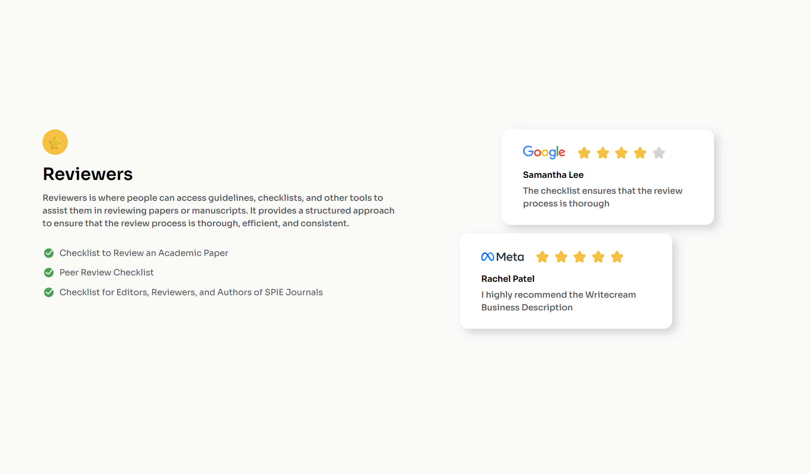

<!-- Please update value in the {}  -->

<h1 align="center">Testimonial Page Master | devChallenges</h1>

   Solution for a challenge <a href="https://devchallenges.io/challenge/testimonial-page" target="_blank">Testimonial Page</a> from <a href="http://devchallenges.io" target="_blank">devChallenges.io</a>.

  <h3>
    <a href="https://jonmc89.github.io/Testimonial-page-master/">
      Demo
    </a>
     | 
    <a href="https://github.com/jonmc89/Testimonial-page-master">
      Solution
    </a>
     | 
    <a href="https://devchallenges.io/challenge/testimonial-page">
      Challenge
    </a>
  </h3>

<!-- TABLE OF CONTENTS -->

## Table of Contents

- [Overview](#overview)
    - [What I learned](#what-i-learned)
    - [Useful resources](#useful-resources)
- [Built with](#built-with)
- [Contact](#contact)

<!-- OVERVIEW -->

## Overview

<!--
Introduce your projects by taking a screenshot or a gif. Try to tell visitors a story about your project by answering:

- What have you learned/improved?
- Your wisdom? :)
-->

### Built with

<!-- This section should list any major frameworks that you built your project using. Here are a few examples.-->

- Semantic HTML5 markup
- CSS custom properties
- Flexbox
- CSS Grid

## Features

<!-- List the features of your application or follow the template. Don't share the figma file here :) -->

This application/site was created as a submission to a [DevChallenges](https://devchallenges.io/challenges-dashboard) challenge.

## Acknowledgements

<!-- This section should list any articles or add-ons/plugins that helps you to complete the project. This is optional but it will help you in the future. For exmpale -->

## Author

- GitHub [jonmc89](https://{github.com/jonmc89})
